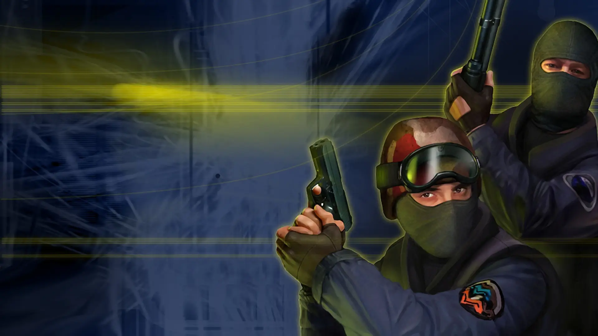

# counter-strike 1.6 fan art



This project is an unofficial tribute inspired by the Counter-Strike 1.6 graphical user interface. It is not affiliated with, endorsed, or approved by Valve. All original design elements and trademarks are the property of their respective owners. This project is for educational purposes only and has no commercial intent.


## Recommended IDE Setup

[VSCode](https://code.visualstudio.com/) + [Volar](https://marketplace.visualstudio.com/items?itemName=Vue.volar) (and disable Vetur).

## Customize configuration

See [Vite Configuration Reference](https://vite.dev/config/).

## Project Setup

```sh
npm install
```

### Compile and Hot-Reload for Development

```sh
npm run dev
```

### Compile and Minify for Production

```sh
npm run build
```

### Docker Compose
```
docker compose up
```